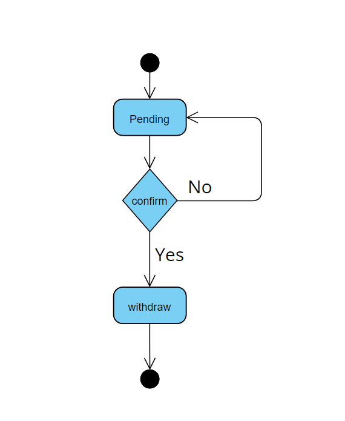

#  Vacation Tracking System
The Vacation Sysytem Idea in textbook named  `The Object Oriented Analysis And Design` is an innovative solution designed to streamline and manage employee leave requests efficiently. This project showcases the integration of advanced technologies to simplify vacation tracking processes and enhance organizational productivity.
###ACTORS
1. Employee
2. Manager
3. Clerk
4. Admin
### USE CASES
> discussing some cases in project
1. Manage Time
   1. Create new Request
   2. Withdraw pending request
   3. Cancel Approved Request
   4. Edit pending request
      
      
      
      

### Database Design
   


### Create new Request


#### flowchart


#### Sequence diagram


### Manager Flow
#### flowchart


### Clerk/Hr Flow
#### flowchart


### Withdraw pending request
#### flowchart


#### Sequence diagram


#### state machine



#### Psuedo code

```
loginToPortal();
redirectToVTS();
getPendingRequests();
confirmed = withdrawRequest(reqest_id);
if(confirmed)
changeStatus(reqest_id);
notifyManager(reqest_id);
}else{
closeConfirmPopUp()
}
```
### cancel approved request
#### flowchart


#### Sequence diagram


#### Psuedo code
````
LoginToPortal();
redirectToVTS();
getApprovedRequests();
approved = cancelApprovedRequest(request_id);
if(approved)
returnEmpAllowance();
notify();

cancelApprovedReq(request_id){
  validateCanelation(request_id);
}
validateCanelation(request_id){
  if(request > 5 working days in past || request in future)
    return true
}
````


### Edit pending request
#### flowchart


#### Sequence diagram


#### state machine


#### Psuedo code
````
LoginToPortal();
redirectToVTS();
getPendingRequests();
valid = updateRequest(request_id);
if(valid)
  updateDB();

if(withdraw)
  confirmed = withdrawRequest(request_id);

if(confirmed)
  updateDB();
   notify();

withdrawRequest(request_id){
  return withdrawRequest(request_id);
}
updateRequest(request_id){
 return validateData(request_id);
}
````
